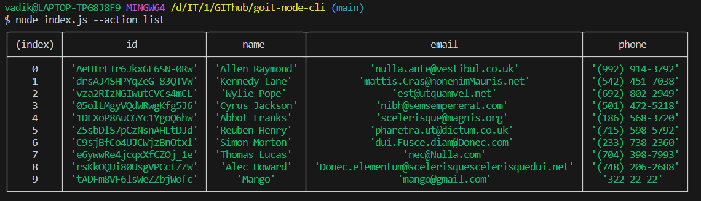
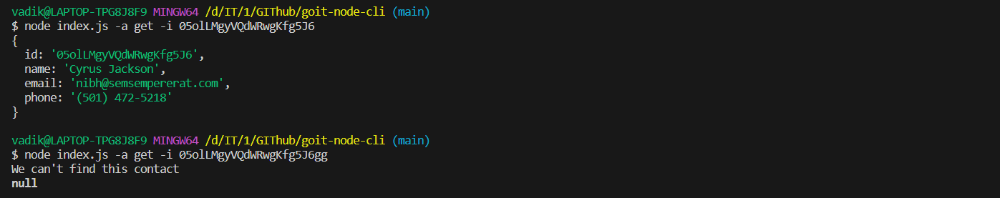
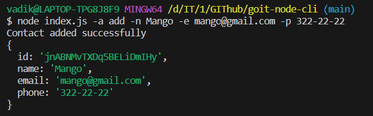
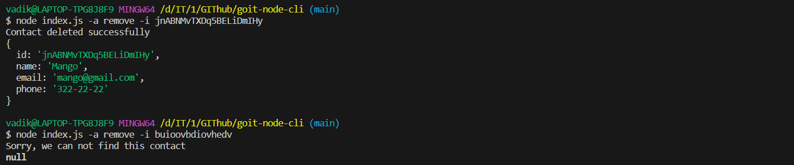

# Завдання №1 Node.js

## отримуємо та виводим список контактів

```bash
node index.js --action list

```



## Отримання контактів по id

```bash
node index.js -a get -i 05olLMgyVQdWRwgKfg5J6
```



## Додавання контактів

````bash
node index.js -a add -n Mango -e mango@gmail.com -p 322-22-22

```



## Видалення контактів

```bash
node index.js -a remove -i jnABNMvTXDq5BELiDmIHy
````


